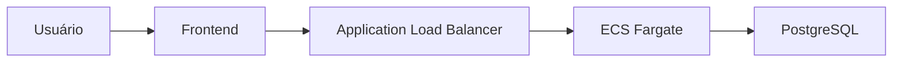

🚀 TestandoAws

Aplicação full stack de gestão de tarefas construída para prática real de deploy na AWS usando CLI first approach.

O projeto demonstra um fluxo moderno de engenharia:

- Frontend e Backend separados
- Containerização com Docker
- Deploy automatizado na AWS
- Execução local via Docker Compose
- Infraestrutura scriptada (laboratório DevOps)


## 🧱 Arquitetura da Aplicação
Local
```mermaid
flowchart LR
    U[👤 Usuário] --> FE[Frontend (localhost:8080)]
    FE -->|/api/* (proxy)| BE[Backend API :3002]
    BE --> DB[(PostgreSQL)]


Local
flowchart LR
  Usuário --> Front [(localhost:8080)]
  Front --> |/api/* (proxy)| Back[Backend API :3002]
  Back --> DB[(PostgreSQL)]

```
AWS

## 📁 Estrutura do Projeto

```bash
TestandoAws/
│
├── api/                    # Backend Node.js + Express
│   ├── src/
│   ├── Dockerfile
│   └── .env.example
│
├── client/                 # Frontend React + Vite + TS
│   ├── src/
│   ├── public/
│   ├── Dockerfile
│   └── .env.example
│
├── infra/                  # Automação AWS via CLI
│   ├── ecs/                # Scripts ECS/Fargate
│   ├── ecr/                # Scripts ECR
│   ├── ec2/                # Scripts EC2
│   ├── rds/                # Script criação RDS
│   ├── env/                # Variáveis de infra
│   └── docs/
│
├── scripts/                # Scripts utilitários
│   ├── react.sh
│   └── s3.sh
│
├── docker-compose.yml      # Ambiente local completo
├── db.env.example
└── README.md

```

✨ Funcionalidades

🔐 Autenticação (mock)

- Login persistido em "localStorage"
- Rotas protegidas
- Logout

📊 Dashboard

- Health da API
- Health do banco
- Informações de runtime
- CRUD completo de tarefas
- Paginação e filtros
- Campo opcional "dueDate"

---

🐳 Execução Local (Docker)

1️⃣ Preparar variáveis

cp api/.env.example api/.env
cp client/.env.example client/.env
cp db.env.example db.env

2️⃣ Subir containers

docker compose up --build

3️⃣ Acessar

- Frontend → http://localhost:8080
- Backend → http://localhost:3002

---

🧪 Execução em modo dev (sem Docker)

Backend

cd api
npm install
npm start

Frontend

cd client
npm install
npm run dev

---

🔧 Variáveis de Ambiente

Backend ("api/.env")

PORT=3002
DB_HOST=db
DB_PORT=5432
DB_USER=postgres
DB_PASSWORD=postgres
DB_NAME=appdb
DB_SSL=false
APP_VERSION=local
CORS_ORIGIN=http://localhost:8080

---

Frontend ("client/.env")

API_URL=

👉 Se vazio, usa "/api" (same-origin)

---

Banco ("db.env")

POSTGRES_USER=postgres
POSTGRES_PASSWORD=postgres
POSTGRES_DB=appdb

---

🌐 Endpoints da API

Health

GET /health
GET /api/health
GET /api/db-health
GET /api/info

Tasks

GET    /api/tasks
POST   /api/tasks
PATCH  /api/tasks/:id
DELETE /api/tasks/:id

Exemplo de criação

{
  "title": "Ajustar health check",
  "dueDate": "2026-03-10"
}

---

☁️ Infraestrutura AWS (CLI)

A pasta "infra/" contém scripts para provisionamento.

---

🔹 ECR

Criar repositório:

cd infra/ecr
./criar_ecr.sh

Build e push:

cd api
../infra/ecr/build_ecr.sh

---

🔹 ECS Fargate

Fluxo recomendado:

cd infra/ecs

./req_fargate.sh
./criar_taskdef.sh
./criar_service.sh

Para novo deploy:

./updt_service.sh

---

🔹 RDS PostgreSQL

cd infra/rds
./criar_rds.sh

---

🔹 EC2 (opcional)

Scripts auxiliares em:

infra/ec2/

Inclui:

- criação de instância
- security groups
- user data bootstrap

---

📦 Scripts Utilitários

Build do React

./scripts/react.sh

---

Sync para S3

./scripts/s3.sh

⚠️ Ajustar bucket/profile antes de usar.

---

🧠 Decisões de Arquitetura

- Frontend e backend desacoplados
- Fargate para execução serverless de containers
- Logs via CloudWatch
- Segurança por Security Groups restritivos
- Infraestrutura reproduzível via CLI

---

🚧 Roadmap

- [ ] CloudFront
- [ ] CI/CD pipeline
- [ ] Terraform/IaC
- [ ] Observabilidade avançada

---

👨‍💻 Autor

Rildo Dias

Projeto criado com foco em evolução para nível Cloud / DevOps Engineer.

---

⭐ Se este projeto te ajudou, considere dar uma estrela!
