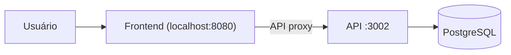
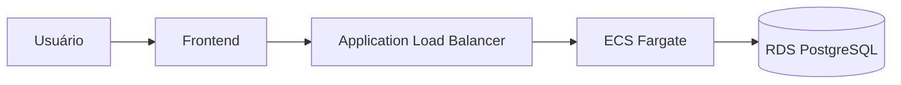

🚀 TestandoAws

Aplicação full stack de gestão de tarefas construída(via gpt) para prática real de deploy na AWS usando CLI first approach.

O projeto demonstra um fluxo moderno de engenharia:

- Frontend e Backend separados
- Containerização com Docker
- Deploy automatizado na AWS
- Execução local via Docker Compose
- Infraestrutura scriptada (laboratório DevOps)


## 🧱 Arquitetura da Aplicação
Local


AWS

## 📁 Estrutura do Projeto

```bash
TestandoAws/
│
├── api/                    # Backend Node.js + Express
│   ├── src/
│   ├── Dockerfile
│   └── .env.example
│
├── client/                 # Frontend React + Vite + TS
│   ├── src/
│   ├── public/
│   ├── Dockerfile
│   └── .env.example
│
├── infra/                  # Automação AWS via CLI
│   ├── ecs/                # Scripts ECS/Fargate
│   ├── ecr/                # Scripts ECR
│   ├── ec2/                # Scripts EC2
│   ├── rds/                # Script criação RDS
│   ├── env/                # Variáveis de infra
│   └── docs/
│
├── scripts/                # Scripts utilitários
│   ├── react.sh
│   └── s3.sh
│
├── docker-compose.yml      # Ambiente local completo
├── db.env.example
└── README.md

```

✨ Funcionalidades

🔐 Autenticação (mock)

- Login persistido em "localStorage"
- Rotas protegidas
- Logout

📊 Dashboard

- Health da API
- Health do banco
- Informações de runtime
- CRUD completo de tarefas
- Paginação e filtros
- Campo opcional "dueDate"

---

🐳 Execução Local (Docker)

1️⃣ Preparar variáveis

cp api/.env.example api/.env
cp client/.env.example client/.env
cp db.env.example db.env

2️⃣ Subir containers

docker compose up --build

3️⃣ Acessar

- Frontend → http://localhost:8080
- Backend → http://localhost:3002

---

🧪 Execução em modo dev (sem Docker)

Backend

cd api
npm install
npm start

Frontend

cd client
npm install
npm run dev

---

🧠 Decisões de Arquitetura

- Frontend(S3) e backend(ECS) desacoplados
- Fargate para execução serverless de containers
- Alta disponibilidade 
- Segurança por Security Groups restritivos
- Infraestrutura reproduzível via CLI
- Logs via Cloudwatch

---

🚧 Roadmap

- [ ] CloudFront
- [ ] CI/CD pipeline
- [ ] Terraform/IaC
- [ ] Observabilidade avançada

---

👨‍💻 Autor

Rildo Dias

Projeto criado com foco em evolução para nível Cloud / DevOps Engineer.

---

⭐ Se este projeto te ajudou, considere dar uma estrela!
